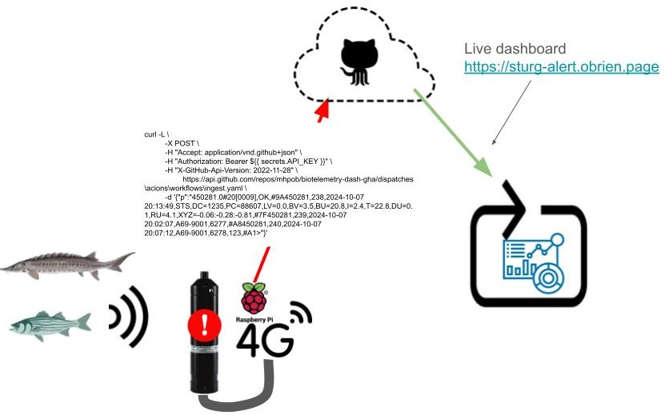

# Build an acoustic telemetry dashboard using the GitHub REST API

Check out the example dashboard here: <https://sturg-alert.obrien.page/>.

Note that this is just an example -- the receiver was removed from the water on
October 15, 2024 and is no longer transmitting data.

## Usage

To give this a test:

  1. [Clone this repository](https://docs.github.com/en/repositories/creating-and-managing-repositories/cloning-a-repository). You can also fork it,
    but make sure "Copy the `main` branch only" is *NOT* checked.
  2. [Create a GitHub personal access token](https://docs.github.com/en/authentication/keeping-your-account-and-data-secure/managing-your-personal-access-tokens#creating-a-fine-grained-personal-access-token)
    with read and write access to actions. Make sure you save this somewhere!
  3. In `Settings` > `Pages`, make sure `Source` is "Deploy from a branch" and 
    `Branch` is "gh-pages".
  4. Send the dashboard some data! You can do this a whole bunch of ways, including
    using `curl` as in the image above; with the
    [httr2 R package](https://httr2.r-lib.org/index.html) as in the example located in
    [`work/payload_sender.R`](https://github.com/mhpob/biotelemetry-dash-gha/blob/main/work/payload_sender.R) (exchange the word
    ["TOKEN" in line 7](https://github.com/mhpob/biotelemetry-dash-gha/blob/7f25c2318c00ae1b361b986271fcdea1b6dbcdd9/work/payload_sender.R#L7)
    with your GitHub PAT and emember not to commit this line to GitHub!!); or,
    after running it at least once, with the "Run workflow" button under `Actions` >
    Create live dashboard.

## General notes

  - Setting up the GitHub Actions runner takes around 60 second as it involves
  downloading and installing Quarto, R, and all dependencies of the quarto and 
  knitr packages. Building the dashboard takes another 10s or so. Because of this,
  it doesn't make much sense to rebuild the dashboard at a faster rate than every
  2 minutes.
  - I am assuming that data will be pulled from the cabled receiver using the RTM2
  mode, AKA "block polling". This saves battery as the receiver can turn off its
  serial port, and we can't really go too fast due to the limitations imposed by
  having a fresh server and needing to download/install all of the programs (see
  above). This means that the dashboard isn't really "live", just rebuilt at some
  functional-enough frequency.
  - Concurrency needs to be addressed. This is currently safe for one cabled
  receiver, but there can be issues if multiple receivers are sending data packets
  resulting in multiple repository read/writes. GHA currently only supports one
  queued job -- every other call will kill the operation in front of it.

## Future Tasks

  - Describe remote (field) server set up
    - Needs: RS-485, cellular modem, libcurl or something like it
      - shell script?
  - [Convert into GitHub App?](https://docs.github.com/en/apps/creating-github-apps/registering-a-github-app/registering-a-github-app)

## References

### GitHub Actions (GHA)

  - Configuration of a GHA workflow to take inputs. Inputs will come from the body of the POST webhook sent by the remote server
    - <https://docs.github.com/en/actions/writing-workflows/choosing-when-your-workflow-runs/events-that-trigger-workflows#providing-inputs>
    - <https://docs.github.com/en/actions/writing-workflows/choosing-what-your-workflow-does/accessing-contextual-information-about-workflow-runs#inputs-context>
  - Configuration of the GHA webhook
    - <https://docs.github.com/en/rest/actions/workflows?apiVersion=2022-11-28#create-a-workflow-dispatch-event>
  - Lost souls hoping for a longer queue
    - https://github.com/orgs/community/discussions/12835

### Quarto Dashboards

  - General reference
    - <https://quarto.org/docs/dashboards/>
  - Example workflows using R targets
    - <https://github.com/tail-Winds/rtwb-flyway>
    - <https://github.com/mhpob/henrico-planning-agenda>

### Innovasea cabled instrument ASCII output

  - Rx-LIVE
    - <https://go.innovasea.com/rx_live_receiver_manual.pdf>
    - Example poll, no detection logged:
      - *667057.0#31[0009],OK,#9A\r\n  
      667057,000,2021-06-01 19:36:21.024,STS,DC=23,PC=190,LV=12.0,T=25.1,DU=0.0,RU=0.0,XYZ=-0.06:0.94:-0.22,N=67.0,NP=39.0, #A9\r\n  
      \>
    - Example poll, detection logged:
      - *667057.0#31[0009],OK,#9A\r\n  
      667057,005,2019-09-05 09:42:06.834,STS,DC=60,PC=624,LV=12.6,T=21.5,DU=0.0,RU=0.0,XYZ=-0.06:0.94:-0.22,N=67.0,NP=39.0, #66\r\n  
      667057,006,2019-09-05 09:41:12.623,A69-1601,999,S=66.5,N=39.5,C=0, #7B\r\n  
      667057,007,2019-09-05 09:41:39.901,A69-1601,998,123,S=66.5,N=39.5,C=0, #85\r\n
      \>
  - VR2C
    - <https://go.innovasea.com/vr2c_manual.pdf>
    - Example poll, no detection logged:
      - *450281.0#20[0009],OK,#9A\r\n  
      450281,221,2024-10-07 15:58:49,STS,DC=1229,PC=88504,LV=0.0,BV=3.5,BU=20.7,I=2.3,T=21.7,DU=0.1,RU=4.1,XYZ=-0.06:-0.28:-0.81,#7F\r\n  
      \>
    - Example poll, detection logged:
      - *450281.0#20[0009],OK,#9A\r\n  
      450281,238,2024-10-07 20:13:49,STS,DC=1235,PC=88607,LV=0.0,BV=3.5,BU=20.8,I=2.4,T=22.8,DU=0.1,RU=4.1,XYZ=-0.06:-0.28:-0.81,#7F\r\n  
      450281,239,2024-10-07 20:02:07,A69-9001,6277,#A8\r\n  
      450281,240,2024-10-07 20:07:12,A69-9001,6278,123,#A1\r\n  
      \>
